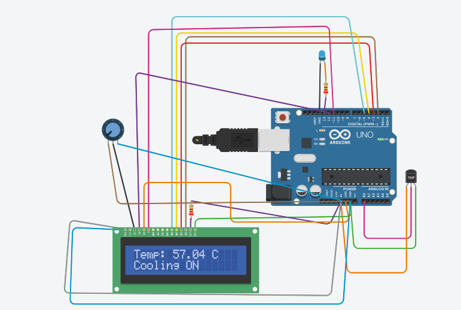

#  Automated Greenhouse System

##  Overview
The Automated Greenhouse System is a smart farming project developed using Arduino Uno and simulated in Tinkercad. It is designed to monitor important environmental conditions such as soil moisture, temperature, and light intensity. Based on the sensor readings, the system automatically controls irrigation and lighting, helping plants grow in a healthy environment while reducing manual effort.

##  Features
- Monitors soil moisture, temperature, and light levels.
- Automatically waters plants when the soil becomes dry.
- Switches on lighting when natural light is insufficient.
- Provides real-time monitoring through sensor data.
- Designed and tested using Tinkercad simulation.

##  Components Used
- Arduino Uno
- Soil Moisture Sensor
- TMP36 Temperature Sensor
- LDR (Light Sensor)
- LED
- Water Pump/Servo (Simulation)
- Breadboard
- Jumper Wires
- Resistors

##  How It Works
The Arduino continuously reads data from the sensors. If the soil moisture level drops below a preset value, the irrigation system is activated automatically. The light sensor detects the surrounding light intensity and turns on the LED when needed. The temperature sensor helps monitor the greenhouse environment, allowing the system to maintain suitable conditions for plant growth.

## Technologies Used
- Arduino IDE (C++)
- Tinkercad
- Embedded Systems

##  Circuit Diagram

##  Tinkercad Simulation
**Project Link:**  
https://www.tinkercad.com/things/hs4qF3E7Net/editel?returnTo=%2Fdashboard&sharecode=_GAMKsyuq1cKJl2kMNCOGdJXsaV_bWSDN99pMBZYvao

##  Future Improvements
- IoT-based remote monitoring
- Mobile application support
- Cloud data logging
- Automatic humidity and fan control

##  Author
**Srujana Panda**

Final-year Electronics and Communication Engineering student with an interest in Embedded Systems, IoT, and automation. This project reflects my hands-on learning in Arduino programming, sensor interfacing, and smart agriculture.
